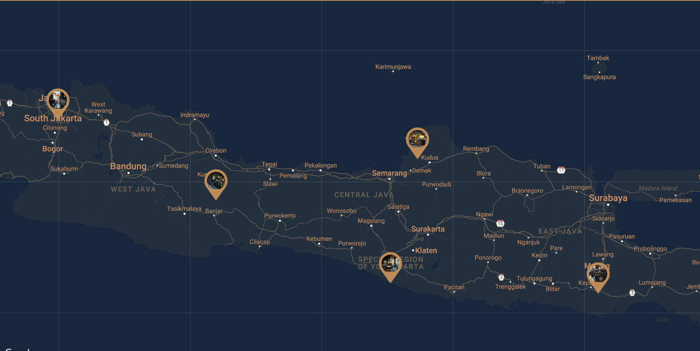
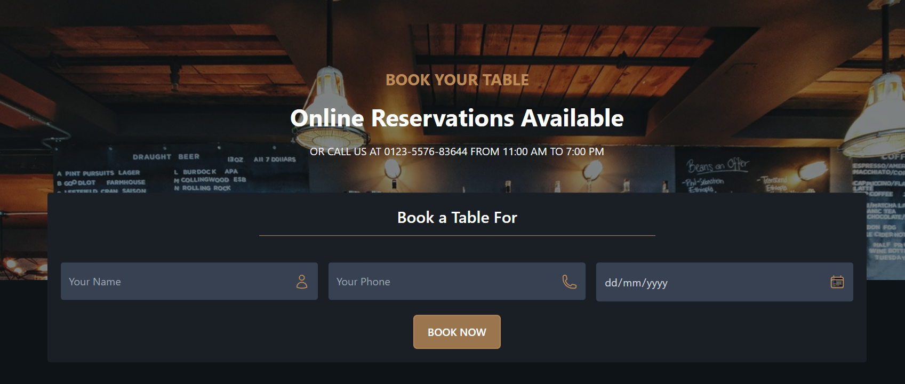
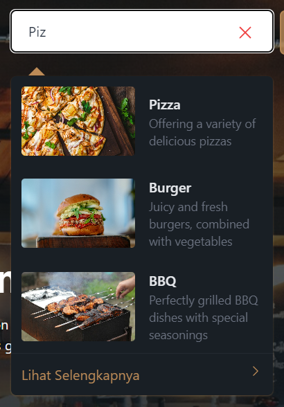

# ALOPE Taste House

ALOPE Taste House is a western-style food and beverage franchise with several branches across Indonesia. Each branch offers a unique menu, such as ALOPE Garden Bistro, which serves healthy organic dishes in a lush garden setting, or ALOPE Grill & Smokehouse, which specializes in grilled and smoked dishes.

DEMO LINK : [preview](https://teknovistafest-alope-taste-house.vercel.app/)

## Instalation Guide

### Step 1

Clone this Project using command

```bash
git clone https://github.com/ilhamhafidz404/TEKNOVISTAFEST_alope-taste-house.git
```

Alternatively, you can download the project by clicking the "Code" button at the top and selecting "Download ZIP."

### Step 2

Navigate to the project directory (if you downloaded the ZIP file, make sure to extract it first), then open Command Prompt and run the following command:

```bash
npm install
```

Wait the installation process...

### Step 3

After successfully installing the dependencies, enter the command to run the local server.

```bash
npm run dev
```

### Step 4

Open the project in your browser by visiting the port provided after completing step 3. (The port may vary, but the default is http://localhost:5173/)

## Website Features

### Location Map



The branches of ALOPE Taste House can be viewed on a map, making it easier for customers to find the nearest location.

### Multi Language


ALOPE Taste House is an Indonesian restaurant offering western cuisine. Therefore, our customers come from both domestic and international locations, making the website global and accessible to everyone, not just locals.

|NOTE| The language switch feature is located in the footer.
|NOTE| The feature is on progress.

### Booking



The booking feature at ALOPE Taste House allows customers to easily make table reservations online. With a simple and intuitive reservation system, customers can select their preferred time and number of guests, ensuring a more comfortable dining experience. We aim to provide convenience for our customers, whether they are coming from domestic or international locations, so they can enjoy our dishes without having to wait.

### Search



Search your Favorite Menu
